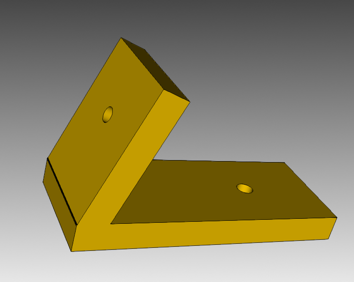

# BHL Display Mount

Display mount for the [Berkeley Humanoid Lite robot](https://berkeley-humanoid-lite.gitbook.io/docs)

## Overview

This mount is designed to attach a [Hosyond 10.1" IPS LCD Capacitive Touch Screen](https://a.co/d/b9ve8qX) to the [Berkeley Humanoid Lite robot](https://berkeley-humanoid-lite.gitbook.io/docs)

## Prerequisites

This project uses [CadQuery](https://cadquery.readthedocs.io/), a Python-based parametric CAD tool

### Installation

1. Install CadQuery and CQ-editor by following the [official installation instructions](https://cadquery.readthedocs.io/en/latest/quickstart.html#prerequisites-cadquery-and-cq-editor-installation)
2. Clone or download this repository

## Usage

Open `bhl_display_mount.py` with the CQ-editor and run it

## License

This project is licensed under the MIT License - see the [LICENSE](LICENSE) file for details 